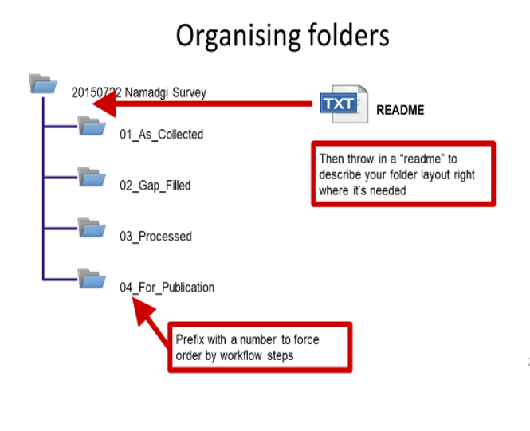

## Step 3
### Folder Structures
---
## Having a standard folder structure can keep your files neat and tidy and save you time looking for data.  It can also help if you are sharing files with colleagues and having a standard place to put working data and documentation.

Like files, folders can also follow a naming convention. By prefixing with numbers, you can force your files to be ordered by the steps in your workflow. Probably the simplest way to document your structure - for your future reference - is to add a “README” file - a text file outlining the contents of the folder. 
---

---
To develop a logical structure for your team, you need to consider the following points:
* Check to make sure there are no pre-existing folder structure agreements
* Name folders appropriately and in a meaningful manner. Don't use staff names and consider using the type of work
* Consistency - make sure you use the agreed structure/hierarchy 
* Structure folders hierarchically - start with a limited number of folders for the broader topics, and then create more specific folders within these
* Separate ongoing and completed work - as you start to create lots of folders and files, it is a good idea to start thinking about separating your older documents from those you are currently working on
* Backup – ensure folders and files are backed up and retrievable in the event of a disaster. Griffith like most universities, have safe storage solutions.
* Clean up folders and files post project.
---
### Beginner
Pick a dataset and illustrate how you currently organise your files.
(For the artists: Draw a picture that describes your current approach to file organisation)  
See if you can devise a better naming convention or note one or two improvements you could make to how you name your files

There's some really good folder template shapes around. [Here's one you are welcome to download and use URL](https://github.com/guereslib/MyResearchProjects/archive/master.zip) 
Or another you could try out if you prefer[from http://nikola.me/](http://nikola.me/assets/Folder_Template.zip)
---
### Advanced

Come up with a policy for your group for folder structures. You could create a template and put it in a downloadable location for them to get them started. 

---
### External Resources
* [Learn more from http://nikola.me/](http://nikola.me/folder_structure.html)
* [Here's one you are welcome to download and use URL](https://github.com/guereslib/MyResearchProjects/archive/master.zip)
